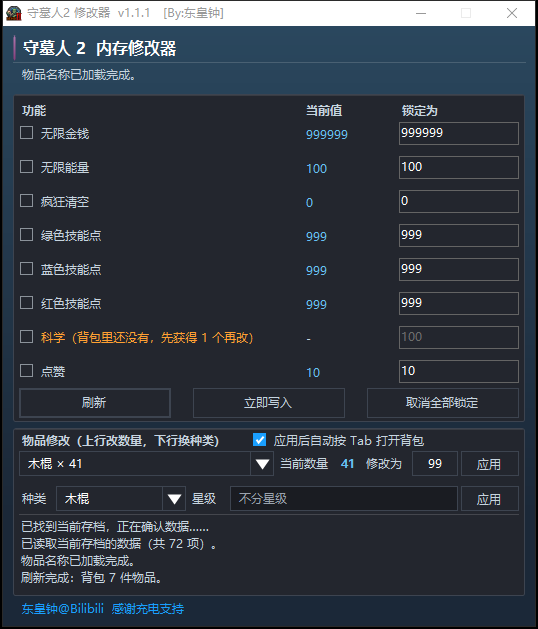

# 守墓人 2 内存修改器

**为《守墓人 2》（Graveyard Keeper 2）正式版做的单机修改器。**
免安装、免联网、不改动游戏文件 —— 一个 129 KB 的单文件 exe，双击就能用。

[](https://github.com/wizardice/GraveyardKeeper2-Trainer/releases/latest)
[](https://github.com/wizardice/GraveyardKeeper2-Trainer/releases)
[](LICENSE)
[](#五兼容性)

> ### ⬇️ [**下载最新版 GK2Trainer.exe**](https://github.com/wizardice/GraveyardKeeper2-Trainer/releases/latest/download/GK2Trainer.exe)
> 单文件、免安装。也可以到 [Releases 页面](https://github.com/wizardice/GraveyardKeeper2-Trainer/releases/latest) 查看更新说明。



| | |
|---|---|
| **版本** | v1.1.1 |
| **作者** | 东皇钟 |
| **适用** | 《守墓人 2》正式版（PC / Steam，Windows 10 及以上） |
| **许可** | Apache-2.0（见 [LICENSE](LICENSE)） |

---

## 一、它能做什么

在游戏运行时直接调整内存里的数值，省掉反复刷资源的功夫。

- **绿色免安装** —— 只有一个文件 `dist\GK2Trainer.exe`，不写注册表、不留后台服务
- **不联网、不改游戏文件** —— 不碰游戏安装目录，不碰存档文件
- **自动识别** —— 自动找到游戏和当前存档；换存档、关掉游戏再打开，它会自己重新连上
- **物品名直接显示中文** —— 物品列表读的是游戏自己的词表，不用你对照英文 ID

## 二、功能一览

| 功能 | 效果 | 默认锁定为 |
|---|---|---|
| 无限金钱 | 金钱保持在你设定的数值 | 999999 |
| 无限能量 | 能量条不再掉 | 100 |
| 疯狂清空 | 把「疯狂」压到 0 并保持住 | 0 |
| 绿色技能点 | 绿色技能点保持满值 | 999 |
| 蓝色技能点 | 蓝色技能点保持满值 | 999 |
| 红色技能点 | 红色技能点保持满值 | 999 |
| 科学 | 研究台里「科学」的数量（**需要先自己获得 1 个**） | 100 |
| 点赞 | 左上角 👍 的数量 | 10 |
| 物品数量修改 | 把背包里某件物品改成你想要的数量（**一次写入，不锁定**） | 99 |
| 物品种类修改 | 把背包里某件物品换成另一种物品 / 另一个星级（**一次写入，不锁定**） | — |

「锁定」= 修改器每 0.25 秒把数值写回一次，所以游戏自己不会把它覆盖掉。
不想要了就取消勾选，或点「取消全部锁定」。

## 三、怎么用

### 三步上手

1. **启动游戏，进入你的存档**
2. **运行修改器** —— 右键 `dist\GK2Trainer.exe` → **以管理员身份运行**（推荐；非管理员通常也能用，遇到读不到数据时再用管理员）
3. **等状态栏出现「刷新完成：当前存档数据已同步。」**，然后勾选你需要的功能

勾上的功能会立刻生效并持续保持。界面下方是日志栏，会一直告诉你现在进行到哪一步。

### 三个按钮

| 按钮 | 作用 |
|---|---|
| **刷新** | 重新读取当前存档（**读档之后点一下这个**） |
| **立即写入** | 马上把当前设定写一遍，不用等下一个写入周期 |
| **取消全部锁定** | 一次性取消所有勾选 |

### 改物品数量 / 换物品种类

「物品修改」区块有**两行**，各有自己的「应用」按钮，互不干扰。

**上行 —— 改数量**

1. 展开下拉列表，选一件背包里的物品（显示形如 `掘尸许可证 × 98`）
2. 右侧「当前数量」会**自动**显示真实数量，并持续跟随刷新
3. 在「修改为」里填目标数量 → 点这一行的 **「应用」**
4. **按 `Tab` 关掉再打开背包**，就能看到新数量

**下行 —— 换种类 / 换星级**

1. 先在**上行**选中要改的那件物品（两行改的是**同一件物品**的不同属性）
2. 「种类」里选要换成什么，「星级」里选星级或红白属性
   （该物品只有一种形态时，「星级」会置灰并显示「不分星级」/「仅一种星级」，属正常）
3. 点这一行的 **「应用」** → 按提示重开背包

> 勾上「应用后自动按 Tab 打开背包」，写入成功后会**自动切回游戏并按两次 `Tab`**，省得手动切窗口。

> 这两项都是**一次性写入**，不会锁定 —— 之后游戏里正常拾取、消耗都会照常增减。

### 两个需要留意的功能

**科学** —— 科学为 0 时游戏根本不会创建这件东西，所以修改器里显示的是
「科学（背包里还没有，先获得 1 个再改）」。先去研究台正常研究一次、拿到 1 点科学，
回到修改器点「刷新」，这一项就会亮起来。改完之后要**重新打开研究台界面**才能看到新数字。

**点赞** —— 改完**立刻生效**，但左上角的 👍 平时是不重绘的。
随便做一次能 **+1 👍** 的操作（比如卖出一件商品），数字就会更新成你设定的值。

## 四、常见问题

**修改器一直显示「等待游戏启动……」**
先启动游戏并**进入存档**。如果游戏已经在跑了还是不动，用「以管理员身份运行」重开修改器。

**物品下拉列表是空的**
按 `Tab` 打开一次背包，再点「刷新」。

**数量改了，背包里却没变**
按 `Tab` **关掉再打开**背包。常驻的快捷栏和 HUD 不会自动刷新，这是游戏自己的行为，不是修改器没生效。

**改完游戏崩溃 / 数值被还原**
先点「刷新」重新读取存档再改。如果游戏刚刚更新过版本，可能还没适配（见下一节）。

**杀毒软件/Windows 提示风险**
这是自编译的 .NET 小程序，容易被启发式引擎误报。源码全部在 `src\` 里，你可以自己编译一份（见第七节）。

**我的存档会坏吗**
修改只作用在**当前运行的游戏内存**里。但请注意：**如果你改完立刻让游戏存档，新数值就会被写进存档文件，且不可逆。**
建议动手前先手动备份一份存档，或者改完了不要马上存档、尽快用掉。

## 五、兼容性

- **只支持《守墓人 2》正式版**（PC / Steam）。早期体验版不在支持范围内。
- 需要 **Windows 10 或以上**（用到系统自带的 .NET Framework 4.8，无需另外安装）。
- 游戏如果有一天改成 **IL2CPP** 打包，本修改器会失效并提示「游戏版本不受支持，请确认是正式版《守墓人 2》。」。
- 若机器上同时装有**《守墓人 1》**，修改器可能先连到旧作，此时它会停在等待状态、**不会写入任何数据**。

游戏更新后想确认还能不能用，跑一次自检脚本（10 秒出结论）：

```powershell
.\tools\Check-GameCompat.ps1 -GameDir "<你的游戏安装目录>"
```

## 六、使用须知

- 本工具**仅供单机使用**。请勿用于联机环境、共享存档或任何会影响到他人的场合。
- 修改游戏内存可能违反游戏用户协议，**请自行评估风险**；由此造成的存档异常、成就失效等后果由使用者自负。
- 请先备份存档。作者不对任何数据丢失负责。
- 本工具不收集任何信息、不联网、不写入游戏目录。

## 七、自己编译 / 参与开发

需要 .NET Framework 自带的 `csc.exe`（Windows 自带），在仓库根目录执行：

```powershell
.\tools\Build-Trainer.ps1
```

产物会生成到 `dist\GK2Trainer.exe`。

- **源码**：`src\`（5 个 C# 文件，C# 5 语法）
- **构建脚本**：`tools\Build-Trainer.ps1`（一键编译，产物输出到 `dist\`）
- **兼容性自检**：`tools\Check-GameCompat.ps1`（游戏更新后 10 秒确认是否仍可用）

> ⚠️ **请勿改动窗口标题中的作者署名**：`守墓人2 修改器  v1.1.1   [By:东皇钟]`。
> （版本号随每次发版递增，与 GitHub Release 的 tag 保持一致。）

## 八、致谢

感谢每一位充电支持的观众，你们的支持是这个项目继续更新的动力。

**东皇钟@Bilibili** → <https://space.bilibili.com/238444>

## 九、许可

本项目采用 **Apache License 2.0** 发布，详见 [LICENSE](LICENSE)。

《Graveyard Keeper 2》及其全部美术资源、商标、游戏数据的版权归
**Lazy Bear Games / tinyBuild** 所有。本项目为社区自制的第三方工具，
与上述公司**没有任何隶属或背书关系**。
本程序仅供个人学习研究使用，请勿用于商业用途
